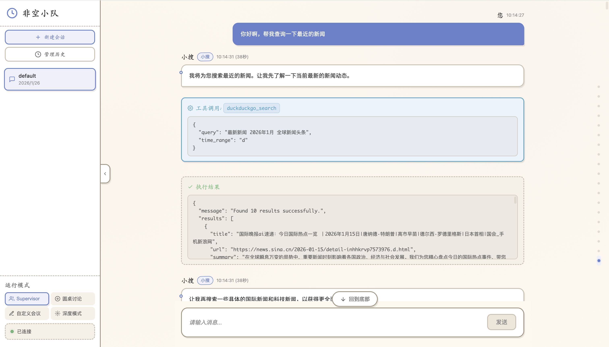
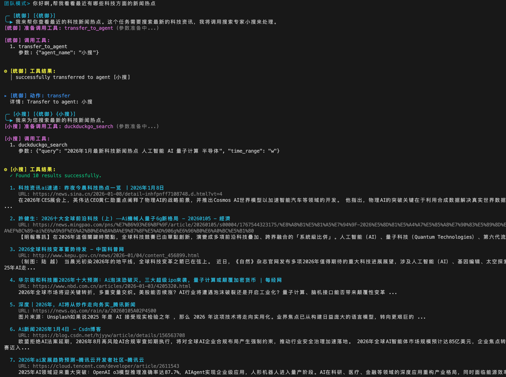

# fkteams 非空团队

fkteams（FeiKong Teams，非空团队）是一个开源的多智能体协作 AI 助手，旨在通过多个专业智能体的协同工作来完成复杂的任务。它支持两种交互界面：现代化的 Web 界面和传统的命令行界面，满足不同用户的使用习惯和场景需求。


## 演示图

### Web 界面模式



### 命令行模式



## 特性

### 双界面支持

#### Web 界面模式

- **现代化 Web 界面**：提供直观的聊天界面，支持实时消息流显示
- **Markdown 渲染**：完整支持代码高亮、表格、列表等 Markdown 格式
- **会话管理**：支持自定义会话 ID，便于管理不同主题的对话
- **历史导出**：一键导出当前对话为格式化 HTML 文件
- **响应式设计**：支持桌面和移动设备访问
- **侧边栏控制**：可折叠侧边栏，支持三种模式切换和会话配置

#### 命令行模式

- **交互式命令行**：传统的命令行交互体验，适合开发者和高级用户
- **彩色输出**：使用 pterm 提供美观的终端显示效果
- **命令补全**：支持历史命令和自动补全功能

### 多模式架构

fkteams 提供三种工作模式，满足不同场景的需求：

#### 团队模式 (Team Mode)

- **监督者模式架构**：由"统御"智能体负责任务规划和智能体调度
- **多智能体协作**：包含五个专业智能体，各司其职
  - **小搜 (Searcher)**：信息搜索专家，支持 DuckDuckGo 网络搜索
  - **小码 (Coder)**：代码专家，支持安全的文件读写操作（限制在 code 目录）
  - **小令 (Cmder)**：命令行专家，支持跨平台命令执行
  - **小访 (Visitor)**：SSH 访问专家，支持通过 SSH 连接远程服务器执行命令和传输文件
  - **小天 (Storyteller)**：讲故事专家，擅长创作和叙述

#### 自定义会议模式 (Custom Mode)

- **灵活的智能体组合**：通过配置文件自定义参与讨论的智能体
- **工具自由配置**：为每个智能体单独配置所需的内置工具和 MCP 工具
- **多模型支持**：每个智能体可使用不同的 AI 模型和提示词
- **监督者协调**：由主持人智能体负责协调和调度自定义智能体
- **适用场景**：需要特定领域专家组合的任务场景

#### 多智能体讨论模式 / 圆桌会议模式 (Roundtable Mode)

- **多模型协作**：支持配置不同的 AI 模型（如 DeepSeek、Claude、GPT 等）作为圆桌讨论成员
- **多轮深度讨论**：多个智能体就同一问题进行多轮讨论，充分吸纳不同角度的分析意见
- **观点融合**：每个讨论者参考他人意见的同时给出独到见解，最终形成更全面准确的结论
- **可配置迭代**：通过 `max_iterations` 控制讨论轮数，平衡讨论深度与效率

### 灵活的模式选择

- **三种模式**：支持团队模式、自定义会议模式和讨论模式（圆桌会议模式）
- **按需启动**：通过命令行参数 `-m team/custom/group` 或 Web 界面选择工作模式
- **场景适配**：
  - **团队模式**：适合标准任务，使用内置的专业智能体
  - **自定义模式**：适合特定领域任务，使用自定义配置的专家智能体
  - **讨论模式**：适合复杂决策，多个 AI 模型深度讨论分析

### 完整的历史记录

- **会话记忆**：支持上下文持久化，多轮对话记忆
- **讨论日志**：记录所有智能体的发言和讨论过程
- **多格式导出**：
  - Web 界面：一键导出为格式化 HTML 文件
  - 命令行：可将完整聊天历史导出为 Markdown 文件
- **历史加载**：支持加载之前保存的聊天历史，继续未完成的对话

### 强大的工具生态

- **内置工具**：文件操作、命令执行、SSH 连接、网络搜索等基础工具
- **MCP 协议支持**：完整支持 Model Context Protocol (MCP)，可接入丰富的 MCP 工具生态
- **多种连接方式**：支持 HTTP、SSE、Stdio 三种 MCP 连接方式
- **灵活配置**：通过配置文件轻松添加和管理 MCP 服务

### 自定义智能体系统

- **灵活创建**：通过配置文件轻松创建自定义智能体
- **自由组合工具**：为每个智能体配置所需的内置工具和 MCP 工具
- **独立模型配置**：每个智能体可以使用不同的 AI 模型和提示词
- **系统提示词定制**：完全自定义智能体的行为和能力

### 其他特性

- **流式输出**：实时显示智能体思考过程和工具调用
- **安全限制**：文件操作限制在指定目录，避免意外修改系统文件
- **多界面支持**：Web 界面和命令行界面并存，适应不同使用场景
- **自动更新**：支持在线检查和更新到最新版本

## 快速开始

> **💡 快速体验**：如果你已经有预编译的可执行文件，只需要配置环境变量并运行 `./fkteams --web` 即可立即体验 Web 界面！

### 1. 克隆项目

```bash
git clone https://github.com/wsshow/feikong-teams.git
cd feikong-teams
```

### 2. 配置环境变量

复制 `.env.example` 为 `.env` 并配置：

```bash
cp .env.example .env
```

编辑 `.env` 文件，填写必要的配置：

```env
# 模型配置
FEIKONG_OPENAI_API_KEY=your_api_key_here
FEIKONG_OPENAI_BASE_URL=https://api.openai.com/v1
FEIKONG_OPENAI_MODEL=gpt-5

# 网络搜索工具配置（可选）
FEIKONG_PROXY_URL=http://127.0.0.1:7890

# 文件工具的使用目录, 默认为: ./workspace
FEIKONG_FILE_TOOL_DIR = ./workspace

# Todo工具的使用目录, 默认为: ./workspace
FEIKONG_TODO_TOOL_DIR = ./workspace

# git 工具的使用目录, 默认为: ./workspace
FEIKONG_GIT_TOOL_DIR = ./workspace

# excel 工具的使用目录, 默认为: ./workspace
FEIKONG_EXCEL_TOOL_DIR = ./workspace

# uv 工具的使用目录, 默认为: ./workspace
FEIKONG_UV_TOOL_DIR = ./workspace

# bun 工具的使用目录, 默认为: ./workspace
FEIKONG_BUN_TOOL_DIR = ./workspace

# 代码助手
FEIKONG_CODER_ENABLED = false

# 本地命令行助手
FEIKONG_CMDER_ENABLED = false

# 数据分析师
FEIKONG_ANALYST_ENABLED = false

# SSH 访问者智能体配置（可选）
FEIKONG_SSH_VISITOR_ENABLED=true # 设置为 true 启用小访智能体
FEIKONG_SSH_HOST=ip:port
FEIKONG_SSH_USERNAME=your_ssh_user
FEIKONG_SSH_PASSWORD=your_ssh_password
```

### 3. 配置圆桌会议成员（可选）

生成示例配置文件：

```bash
./fkteams -c
# 或
./fkteams --generate-config
```

编辑 `config/config.toml` 配置圆桌会议成员、MCP 服务和自定义智能体：

```toml
[server]
port = 23456        # Web服务器端口
log_level = "info"  # 日志级别

# 圆桌会议配置
[roundtable]
max_iterations = 2  # 讨论轮数

[[roundtable.members]]
index = 0
name = '深度求索'
desc = '深度求索聊天模型，擅长逻辑分析'
base_url = 'https://api.deepseek.com/v1'
api_key = 'your_deepseek_api_key'
model_name = 'deepseek-chat'

[[roundtable.members]]
index = 1
name = '克劳德'
desc = '克劳德聊天模型，擅长创意思维'
base_url = 'https://api.anthropic.com/v1'
api_key = 'your_claude_api_key'
model_name = 'claude-3-sonnet'

# 自定义智能体配置
[custom]

# 配置自定义智能体
[[custom.agents]]
name = "数据分析师"
desc = "专业的数据分析智能体"
system_prompt = """你是一个专业的数据分析师，擅长数据处理和可视化。
你需要：
1. 分析用户提供的数据
2. 使用合适的工具进行数据处理
3. 生成可视化图表
4. 给出专业的分析建议
"""
base_url = "https://api.openai.com/v1"
api_key = "your_api_key"
model_name = "gpt-4"
tools = ["file", "command", "mcp-filesystem"]  # 可使用内置工具和MCP工具

# 配置 MCP 服务
[[custom.mcp_servers]]
name = "filesystem"  # MCP服务名称，使用时需加前缀：mcp-filesystem
desc = "文件系统操作工具"
enabled = true
timeout = 30
url = "http://127.0.0.1:3000/mcp"
transport_type = "http"  # 支持 http, sse, stdio

[[custom.mcp_servers]]
name = "database"
desc = "数据库操作工具"
enabled = true
timeout = 30
command = "npx"  # 或 "uvx" for Python
env_vars = ["DATABASE_URL=postgresql://localhost/mydb"]
args = ["-y", "@modelcontextprotocol/server-postgres"]
transport_type = "stdio"  # stdio 方式启动本地 MCP 服务
```

**配置说明**：

#### 内置工具列表

- `file` - 文件读写操作（限制在 code 目录）
- `command` - 命令行执行
- `ssh` - SSH 远程连接
- `search` - 网络搜索（DuckDuckGo）
- `todo` - 待办事项管理

#### MCP 工具使用

- MCP 工具在配置时需要添加 `mcp-` 前缀
- 例如：名为 `filesystem` 的 MCP 服务，在工具列表中写作 `mcp-filesystem`
- 支持三种连接方式：
  - **HTTP**：连接远程 HTTP MCP 服务
  - **SSE**：通过 Server-Sent Events 连接
  - **Stdio**：启动本地 MCP 进程并通过标准输入输出通信

#### 自定义智能体配置要点

- `name`：智能体名称，用于标识
- `desc`：智能体描述，帮助用户了解其能力
- `system_prompt`：系统提示词，定义智能体的行为和能力
- `tools`：工具列表，可包含内置工具和 MCP 工具
- `base_url`、`api_key`、`model_name`：AI 模型配置

### 4. 运行

#### Web 界面模式（推荐）

启动 Web 服务器，通过浏览器访问：

```bash
# 使用预编译版本
./release/fkteams_darwin_arm64 --web

# 或直接编译运行
go run main.go --web
```

启动后访问 `http://localhost:23456` 即可使用 Web 界面。

Web 界面特性：

- 实时聊天界面，支持流式输出显示
- 智能滚动控制和历史消息浏览
- 完整的 Markdown 渲染支持
- 一键导出对话历史为 HTML 文件
- 响应式设计，支持移动端访问
- 可折叠侧边栏和模式切换

#### 命令行模式

适合开发者和高级用户：

```bash
# 默认启动团队模式
go run main.go

# 启动自定义会议模式
go run main.go -m custom

# 启动多智能体讨论模式
go run main.go -m group
```

#### 编译后运行

```bash
make build

# Web界面模式
./release/fkteams_darwin_arm64 --web

# 默认启动团队模式
./release/fkteams_darwin_arm64

# 启动自定义会议模式
./release/fkteams_darwin_arm64 -m custom

# 启动多智能体讨论模式
./release/fkteams_darwin_arm64 -m group
```

### 5. 使用

#### Web 界面使用

1. 启动 Web 服务：`./fkteams --web`
2. 打开浏览器访问：`http://localhost:23456`
3. 在聊天界面输入你的问题或任务
4. 实时查看 AI 助手的回复和工具调用过程
5. 使用侧边栏切换工作模式（团队/自定义/讨论）
6. 点击"导出 HTML"按钮保存对话历史

#### 命令行使用

启动后，在命令行输入你的问题或任务：

```
请输入您的问题: 帮我写几篇相互关联的小小说，然后创建一个网站来展示这些小说。
```

#### 常用命令（命令行模式）

| 命令                            | 说明                                         |
| ------------------------------- | -------------------------------------------- |
| `quit` / `q`                    | 退出程序                                     |
| `list_agents`                   | 列出所有可用的智能体                         |
| `@智能体名 [查询内容]`          | 切换到指定智能体并可选执行查询               |
| `switch_work_mode`              | 切换工作模式（团队模式/自定义模式/讨论模式） |
| `save_chat_history`             | 保存聊天历史                                 |
| `load_chat_history`             | 加载聊天历史                                 |
| `clear_chat_history`            | 清空聊天历史                                 |
| `save_chat_history_to_markdown` | 导出聊天历史为 Markdown 文件                 |
| `clear_todo`                    | 清空待办事项                                 |
| `help`                          | 显示帮助信息                                 |

#### 智能体切换功能

从交互模式下，你可以直接与单个智能体对话，无需启动整个团队：

```
# 列出所有可用的智能体
list_agents

# 切换到小析（数据分析专家）
@小析

# 切换并直接提问
@小码 帮我创建一个 Python 脚本

# 切换到小搜并搜索信息
@小搜 查找最新的 Go 语言教程
```

**可用智能体列表**：
- `@小析` - 数据分析专家，擅长使用 Excel 和 Python 脚本从复杂数据中提取有价值的信息
- `@小码` - 代码专家，擅长读写和处理代码文件，能够帮助用户完成各种编程任务
- `@小令` - 命令行专家，擅长通过命令行操作完成任务，能够根据操作系统环境执行合适的命令
- `@小搜` - 搜索专家，擅长通过DuckDuckGo提供准确的信息搜索服务
- `@小访` - 远程访问专家，擅长通过 SSH 连接远程服务器，执行命令、传输文件和管理远程系统
- `@小天` - 讲故事专家，擅长编写引人入胜的故事
- `@小简` - 总结专家，擅长将冗长的信息提炼为简洁的摘要

**提示**：输入 `@` 符号后会自动显示可用的智能体列表供选择。

#### 命令行参数

| 参数                | 简写 | 说明                                                           |
| ------------------- | ---- | -------------------------------------------------------------- |
| `--web`             | `-w` | 启动 Web 服务器模式（推荐）                                    |
| `--work-mode`       | `-m` | 工作模式: `team`（团队）、`group`（讨论）或 `custom`（自定义） |
| `--query`           | `-q` | 直接查询模式，执行完查询后退出                                 |
| `--version`         | `-v` | 显示版本信息                                                   |
| `--update`          | `-u` | 检查并更新到最新版本                                           |
| `--generate-env`    | `-g` | 生成示例 .env 文件                                             |
| `--generate-config` | `-c` | 生成示例配置文件                                               |

## 使用场景示例

### Web 界面模式 - 推荐用法

**适合场景**：

- 日常对话和任务处理
- 需要查看历史消息的场景
- 展示给他人或协作使用
- 移动设备访问

**使用流程**：

1. 启动 Web 服务：`./fkteams --web`
2. 浏览器访问：`http://localhost:23456`
3. 在界面中选择工作模式（团队模式/自定义模式/讨论模式）
4. 开始对话，实时查看 AI 回复和工具执行过程
5. 使用"导出 HTML"功能保存重要对话

### 命令行模式

**适合场景**：

- 服务器环境下使用
- 自动化脚本集成
- 开发和调试
- 终端重度用户

**使用流程**：

1. 启动：`./fkteams -m team`
2. 输入任务描述
3. 查看实时输出和工具调用
4. 使用内置命令管理历史和模式切换

## 圆桌会议模式详解

### 工作原理

圆桌会议模式模拟了一场专家研讨会：

1. **问题提出**：用户提出问题或任务
2. **轮流发言**：每个配置的模型依次针对问题发表观点
3. **观点参考**：后发言的模型可以看到前面模型的观点，并在此基础上补充或提出不同见解
4. **多轮迭代**：根据 `max_iterations` 配置进行多轮讨论，逐步深化分析
5. **形成共识**：最终综合各方观点，给出更全面准确的答案

### 适用场景

- **复杂决策**：需要从多角度分析的重要决策
- **创意头脑风暴**：激发不同模型的创意火花
- **观点验证**：让多个模型相互验证，减少单一模型的偏见
- **深度分析**：需要多轮思考才能得出结论的复杂问题

### 配置建议

- 选择不同特点的模型作为讨论成员，以获得更多元的观点
- `max_iterations` 建议设置为 1-3，过多轮次可能导致观点趋同
- 可以给每个成员设置描述性的 `desc`，帮助理解其专长

## MCP 工具集成指南

### 什么是 MCP？

Model Context Protocol (MCP) 是一个开放的协议标准，用于 AI 应用与外部工具和数据源的集成。fkteams 完整支持 MCP 协议，可以轻松接入丰富的 MCP 工具生态。

### MCP 服务配置

在 `config/config.toml` 中配置 MCP 服务：

```toml
[[custom.mcp_servers]]
name = "filesystem"
desc = "文件系统操作工具"
enabled = true          # 是否启用
timeout = 30           # 超时时间（秒）
url = "http://127.0.0.1:3000/mcp"
transport_type = "http"

[[custom.mcp_servers]]
name = "postgres"
desc = "PostgreSQL 数据库工具"
enabled = true
timeout = 30
command = "npx"        # 启动命令
env_vars = ["DATABASE_URL=postgresql://localhost/mydb"]  # 环境变量
args = ["-y", "@modelcontextprotocol/server-postgres"]   # 命令参数
transport_type = "stdio"
```

### 支持的连接方式

1. **HTTP 方式**

   - 适合：远程 MCP 服务
   - 配置：设置 `url` 和 `transport_type = "http"`

2. **SSE 方式**

   - 适合：需要服务器推送的场景
   - 配置：设置 `url` 和 `transport_type = "sse"`

3. **Stdio 方式**
   - 适合：本地 MCP 工具
   - 配置：设置 `command`、`args` 和 `transport_type = "stdio"`
   - 支持通过 `env_vars` 配置环境变量

### 在自定义智能体中使用 MCP 工具

```toml
[[custom.agents]]
name = "数据处理专家"
desc = "专门处理数据相关任务"
system_prompt = "你是一个数据处理专家..."
tools = [
  "file",              # 内置文件工具
  "mcp-filesystem",    # MCP 文件系统工具（需加 mcp- 前缀）
  "mcp-postgres"       # MCP 数据库工具
]
base_url = "https://api.openai.com/v1"
api_key = "your_api_key"
model_name = "gpt-4"
```

### MCP 工具命名规则

- MCP 服务在配置文件中使用 `name` 字段定义
- 在智能体的 `tools` 列表中引用时，需要添加 `mcp-` 前缀
- 例如：`name = "filesystem"` → 使用时写作 `mcp-filesystem`

### 常用 MCP 服务示例

```toml
# 文件系统操作
[[custom.mcp_servers]]
name = "filesystem"
desc = "文件系统读写工具"
enabled = true
command = "npx"
args = ["-y", "@modelcontextprotocol/server-filesystem", "/path/to/allowed/directory"]
transport_type = "stdio"

# GitHub 集成
[[custom.mcp_servers]]
name = "github"
desc = "GitHub API 工具"
enabled = true
command = "npx"
env_vars = ["GITHUB_TOKEN=your_github_token"]
args = ["-y", "@modelcontextprotocol/server-github"]
transport_type = "stdio"

# Google Drive
[[custom.mcp_servers]]
name = "gdrive"
desc = "Google Drive 工具"
enabled = true
command = "npx"
args = ["-y", "@modelcontextprotocol/server-gdrive"]
transport_type = "stdio"

# Brave Search
[[custom.mcp_servers]]
name = "brave-search"
desc = "Brave 搜索引擎"
enabled = true
command = "npx"
env_vars = ["BRAVE_API_KEY=your_api_key"]
args = ["-y", "@modelcontextprotocol/server-brave-search"]
transport_type = "stdio"
```

更多 MCP 服务请访问：https://github.com/modelcontextprotocol/servers

## 自定义智能体使用指南

> **⚠️ 重要提示**：自定义智能体只在**自定义会议模式** (`custom`) 下启用。需要使用 `-m custom` 参数启动或在 Web 界面中选择自定义模式。

### 工作模式说明

自定义智能体与其他工作模式的关系：

- **团队模式** (`team`)：使用内置的五个专业智能体（小搜、小码、小令、小访、小天）
- **讨论模式** (`group`)：使用 `[roundtable.members]` 配置的圆桌会议成员
- **自定义模式** (`custom`)：使用 `[[custom.agents]]` 配置的自定义智能体

### 启动自定义模式

```bash
# 命令行模式
./fkteams -m custom

# Web 模式（在侧边栏选择自定义模式）
./fkteams --web

# 直接查询模式
./fkteams -m custom -q "你的问题"
```

### 创建自定义智能体

1. **编辑配置文件** `config/config.toml`：

```toml
[[custom.agents]]
name = "前端开发专家"
desc = "专注于前端开发的智能体"
system_prompt = """你是一个专业的前端开发工程师。
你擅长：
- React、Vue、Angular 等现代前端框架
- HTML、CSS、JavaScript/TypeScript
- 响应式设计和移动端适配
- 性能优化和最佳实践

你需要：
1. 理解用户的前端开发需求
2. 使用合适的工具创建和修改代码
3. 确保代码质量和最佳实践
4. 提供清晰的技术建议
"""
base_url = "https://api.openai.com/v1"
api_key = "your_api_key"
model_name = "gpt-4"
tools = ["command", "search"]
```

2. **启动自定义模式**：

   ```bash
   # 命令行启动
   ./fkteams -m custom

   # 或 Web 模式中选择自定义模式
   ./fkteams --web
   ```

3. **使用说明**：
   - 自定义模式下会自动加载配置文件中的所有自定义智能体
   - 主持人智能体会根据任务需求调度合适的自定义智能体
   - 可以与内置智能体（如小搜、小天）混合使用

### 配置参数说明

| 参数            | 说明                            | 必填 |
| --------------- | ------------------------------- | ---- |
| `name`          | 智能体名称                      | ✓    |
| `desc`          | 智能体描述                      | ✓    |
| `system_prompt` | 系统提示词，定义智能体的行为    | ✓    |
| `base_url`      | AI 模型 API 地址                | ✓    |
| `api_key`       | API 密钥                        | ✓    |
| `model_name`    | 使用的模型名称                  | ✓    |
| `tools`         | 工具列表（内置工具和 MCP 工具） | ✗    |

### 系统提示词编写技巧

1. **明确角色定位**：清楚说明智能体的专业领域
2. **定义能力范围**：列出智能体擅长的具体技能
3. **设定工作流程**：指导智能体如何处理任务
4. **强调约束条件**：说明需要遵守的规则和限制

### 工具配置最佳实践

1. **按需选择**：只配置智能体真正需要的工具
2. **组合使用**：合理搭配内置工具和 MCP 工具
3. **权限控制**：注意工具的安全性和访问权限

### 使用场景示例

**场景 1：代码审查助手**

```toml
[[custom.agents]]
name = "代码审查专家"
desc = "专业的代码审查和质量分析"
system_prompt = """你是一个严格的代码审查专家...
重点关注：代码质量、安全漏洞、性能问题、最佳实践"""
tools = ["command", "mcp-github"]
```

**场景 2：DevOps 助手**

```toml
[[custom.agents]]
name = "DevOps 工程师"
desc = "自动化运维和部署专家"
system_prompt = """你是一个经验丰富的 DevOps 工程师...
擅长：CI/CD、容器化、监控告警、自动化脚本"""
tools = ["command", "mcp-github"]
```

**场景 3：数据分析师**

```toml
[[custom.agents]]
name = "数据分析师"
desc = "数据处理和可视化专家"
system_prompt = """你是一个数据分析专家...
能力：数据清洗、统计分析、数据可视化、报告生成"""
tools = ["command", "mcp-postgres", "mcp-filesystem"]
```

## 安全说明

- **文件操作限制**：小码智能体的文件操作被限制在可执行文件同级的 `code/` 目录下，防止误操作系统文件
- **命令执行权限**：小令智能体会根据当前操作系统类型（Windows/Linux/macOS）执行相应的命令
- **SSH 连接管理**：小访智能体通过 SSH 连接远程服务器，确保连接信息安全存储和使用
- **MCP 工具隔离**：每个 MCP 服务运行在独立的进程中，可以单独控制启用/禁用
- **工具权限管理**：自定义智能体只能使用配置中明确指定的工具，避免权限滥用
- **日志记录**：所有智能体的操作和输出都会被记录，可以主动输出成 markdown 文件，便于审计和调试
- **工具调用可视化**：所有工具调用都会在终端显示，提供透明度
- **环境变量保护**：请确保 `.env` 文件和 `config.toml` 不被泄露，避免敏感信息外泄

## 构建

```bash
# 清理构建产物
make clean

# 构建当前平台
make build

# 修改 Makefile 中的 os-archs 变量以支持其他平台
# 例如：os-archs=darwin:arm64 linux:amd64 windows:amd64
```

## 许可证

本项目采用 MIT 许可证。详见 [LICENSE](LICENSE) 文件。

## 致谢

- [go-prompt](https://github.com/c-bata/go-prompt) - 交互式命令行提示库
- [Pterm](https://github.com/pterm/pterm) - 美观的终端 UI 库
- [Cloudwego Eino](https://github.com/cloudwego/eino) - 强大的 AI 编程框架
- [MCP Go](https://github.com/mark3labs/mcp-go) - Go 语言的 MCP 协议实现
- [Model Context Protocol](https://modelcontextprotocol.io/) - AI 工具集成标准协议

## 相关链接

- [MCP 官方文档](https://modelcontextprotocol.io/)
- [MCP 服务器列表](https://github.com/modelcontextprotocol/servers)
- [Cloudwego Eino 文档](https://github.com/cloudwego/eino)
- [项目 GitHub](https://github.com/wsshow/feikong-teams)
