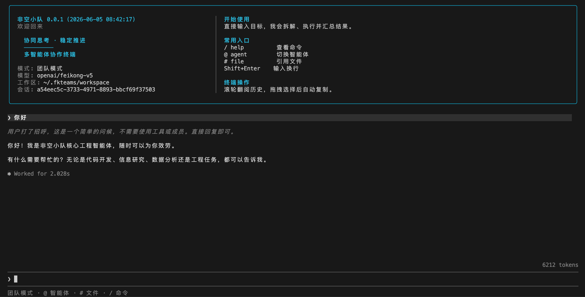

# fkteams 非空小队

fkteams（FeiKong Teams，非空小队）是一个开源的多智能体协作 AI 助手，旨在通过多个专业智能体的协同工作来完成复杂任务。它支持 CLI、Web UI、OpenAI 兼容 API 和消息通道（Discord / QQ / 微信）多种交互方式，满足不同用户的使用习惯和场景需求。


## 演示图

|                     登录界面                     |                   主界面                    |
| :----------------------------------------------: | :-----------------------------------------: |
|  |  |

|                   审批                    |                    子任务进行中                    |
| :---------------------------------------: | :------------------------------------------------: |
|  |  |

|                    子任务完成                     |                   文件管理                    |
| :-----------------------------------------------: | :-------------------------------------------: |
|  |  |

|                       文件分享                       |                        密码访问                         |
| :--------------------------------------------------: | :-----------------------------------------------------: |
|  |  |

|                        分享预览                         |                        批量分享预览                         |
| :-----------------------------------------------------: | :---------------------------------------------------------: |
|  |  |

|                    并行子任务                     |
| :-----------------------------------------------: |
|  |

|                    非交互模式                    |
| :----------------------------------------------: |
|  |

|                   交互模式                    |
| :-------------------------------------------: |
|  |

## 功能特性

- **多智能体协作**：内置多个专业智能体（代码、搜索、数据分析、SSH、通用执行等），由 coordinator 智能调度
- **四种工作模式**：团队模式、深度模式、圆桌会议模式、自定义模式
- **多入口支持**：现代化 Web 界面、命令行界面、纯 API 服务和消息通道
- **MCP 工具生态**：完整支持 MCP 协议，轻松接入外部工具
- **自定义智能体**：通过配置文件灵活创建专业智能体
- **OpenAI 兼容 API**：对外提供 OpenAI 格式接口，任意客户端配置地址和密钥即可使用已配置的模型
- **聊天通道集成**：支持接入 QQ、Discord、微信等即时通讯平台
- **长期记忆**：跨会话自动记忆，助手越用越顺手
- **多模态输入**：支持文本、图片、音频、视频和文件
- **推理模型支持**：流式展示思考过程（DeepSeek-R1、o1/o3 等）
- **统一事件协议**：核心事件、历史记录与终端展示解耦，CLI/Web/Stream/通道共用一致事件结构
- **GitHub Copilot**：一键登录 GitHub Copilot，OAuth 设备码认证
- **流式任务控制**：任务后台独立执行，刷新页面或断开连接不会停止任务，同一会话支持多端实时订阅与断点续接
- **Skills 技能系统**：动态加载技能提升特定任务表现
- **交互式提问**：模型可主动向用户提问，支持选项选择（单选/多选）+ 自由输入
- **定时任务**：自然语言设置定时任务，后台静默执行
- **子任务并行**：generalist 智能体支持多子任务并行处理
- **输出截断自动续接**：检测模型 max_tokens 截断，自动触发续接（自动修复不完整的 JSON ），输出不丢失

## 安装

一键安装脚本会自动下载最新版本并解压到 `~/.fkteams/bin`（Windows 为 `%USERPROFILE%\.fkteams\bin`），同时将该目录添加到 PATH。

**Linux / macOS**

```bash
curl -fsSL https://raw.githubusercontent.com/wsshow/feikong-teams/main/install.sh | bash
```

**Windows (PowerShell)**

```powershell
powershell -c "irm https://raw.githubusercontent.com/wsshow/feikong-teams/main/install.ps1 | iex"
```

> 如需自定义安装目录，可在执行前设置环境变量 `FKTEAMS_INSTALL_DIR`：
>
> - Linux/macOS：`export FKTEAMS_INSTALL_DIR=/your/path`
> - Windows：`$env:FKTEAMS_INSTALL_DIR = "D:\fkteams"`

也可以直接在 [GitHub Releases](https://github.com/wsshow/feikong-teams/releases) 页面手动下载对应平台的压缩包。

## 快速开始

> **快速体验**：安装完成后，只需要生成配置文件并运行 `fkteams web` 即可立即体验 Web 界面！

### 1. 生成配置文件

```bash
fkteams generate config
```

编辑 `~/.fkteams/config/config.toml`，填写模型配置：

```toml
[[models]]
name = "default"
provider = "openai"
base_url = "https://api.openai.com/v1"
api_key = "your_api_key_here"
model = "gpt-5"
```

或使用 GitHub Copilot（需要 Copilot 订阅）：

```bash
# 登录 GitHub Copilot
fkteams login copilot

# 或从 VS Code 已保存的 token 导入（免登录）
fkteams login copilot --import
```

也可通过 `login` 命令快速配置供应商：

```bash
# 交互式选择供应商并配置（推荐）
fkteams login

# 或直接指定供应商
fkteams login openai
fkteams login deepseek
fkteams login copilot         # GitHub Copilot（OAuth 设备码）
fkteams login copilot --import # 从 VS Code 导入 Copilot token

# 模型管理
fkteams model ls                     # 列出已配置的模型
fkteams model rm                     # 交互式选择并移除模型配置
fkteams logout openai                # 退出指定供应商
```

```toml
[[models]]
name = "default"
provider = "copilot"
model = "gpt-4o"
```

> 完整配置项请参考 [配置指南](./docs/configuration.md)

运行期数据默认保存在 `~/.fkteams/` 下，可通过 `FEIKONG_APP_DIR` 覆盖；常用子目录包括 `workspace`、`sessions`、`scheduler`、`history`、`config`、`log`、`share`。

### 2. 运行

```bash
# Web 界面模式（推荐）
fkteams web

# 命令行模式
fkteams

# 纯 API 服务
fkteams serve
```

启动后访问 `http://localhost:23456` 即可使用。

> 更多运行模式和命令行参数请参考 [使用指南](./docs/usage.md)

## 构建与部署

```bash
# 从源码构建
git clone https://github.com/wsshow/feikong-teams.git
cd feikong-teams
make native

# 或指定平台 / 构建预设平台
make build t=linux:amd64
make all

# Docker 部署
docker compose up -d
```

> 详细部署配置请参考 [部署指南](./docs/deployment.md)

## 内置智能体

| 智能体        | 说明                                     | 默认启用 |
| ------------- | ---------------------------------------- | -------- |
| `@coder`      | 软件工程师，代码实现、调试、重构和验证   | ✓        |
| `@researcher` | 网络研究员，检索、抓取和交叉验证时效信息 | 配置启用 |
| `@analyst`    | 数据分析师，Excel、Python 和文档数据处理 | 配置启用 |
| `@remote`     | 远程运维专家，SSH 服务器连接和系统管理   | 配置启用 |
| `@generalist` | 通用执行助手，综合命令、文件、搜索等工具 | 配置启用 |

> 通过 `[[custom.agents]]` 定义的[自定义智能体](./docs/custom-agents.md)也会自动注册，在任意模式下可通过 `@` 或 `agent` 子命令使用。

## 架构与安全边界

- `agentcore` 定义运行时无关的 Agent、Runner、Message、Tool、Event 等核心接口；运行时通过 registry 注册，默认实现为 `eino`；核心工具统一通过 `Tool.Invoke` 执行，函数工具只向适配层暴露输入类型用于 schema 推导；模型装饰、pipeline 和 MCP 工具加载通过可选能力接口扩展；`agentcore/eino` 是当前 CloudWeGo Eino ADK 适配实现，负责模型、工具、中间件、AgentTool 和 HITL resume 的具体落地。
- `engine.Session` 统一装配会话 ID、事件回调、历史记录、非交互标记和人工中断处理，并提供 `WithText` / `WithMessage` / `WithInput` 三种输入入口；Eino 运行时负责具体的 Runner 执行与 HITL resume 协议适配。
- `hooks` 提供运行期扩展点总线，当前接入 `before_run` / `after_run` / `on_event` / `before_tool_call` / `after_tool_call` / `before_model_request` / `after_model_response`；入口层可通过 `Session.WithHookBus` 注入独立 HookBus，未指定时使用全局 HookBus。
- Web、CLI、SSE、WebSocket 和通道入口共用同一执行管线；WebSocket、流式任务和终端交互模式支持运行中 follow-up 排队和 steering 转向，steering 会在工具完成后的下一次模型调用前注入。Web 运行中输入默认追加为 follow-up，可在队列面板中将未执行项转为 steering，并可编辑、删除、上移/下移；终端运行中可随时追加转向消息，下一次模型调用前会合并消费当前队列，按 `Esc` 暂停时会把未消费转向回填到输入框。
- 执行失败会保存为 `error` 会话状态，HTTP 同步接口会返回错误响应。
- 流式事件通过 `events.Emitter` 统一归一化和校验，`events/log` 负责会话历史与元数据，`events/view` 负责终端展示；事件保留 `message_id`、成员智能体作用域、分片顺序和稳定 `tool_call_ref`，Web 前端据此将子智能体思考、工具调用和输出归并到同一成员卡片。
- Runner 可被入口层缓存复用，checkpoint store 为并发安全实现；配置更新会重建 Agent 注册表并清空 Runner/MCP/通道缓存。
- 内置工具必须在工具策略表中声明只读、破坏性、串行化和审批元数据；MCP 和成员智能体工具作为外部扩展，不强制使用内置策略表。

## 文档导航

| 文档                                    | 说明                                     |
| --------------------------------------- | ---------------------------------------- |
| [配置指南](./docs/configuration.md)     | 环境变量、config.toml 配置               |
| [使用指南](./docs/usage.md)             | 运行模式、CLI 命令、智能体切换、定时任务 |
| [圆桌会议模式](./docs/roundtable.md)    | 多模型讨论模式的原理和配置               |
| [Skills 指南](./docs/skills.md)         | 技能系统的使用和配置                     |
| [MCP 工具集成](./docs/mcp.md)           | MCP 协议集成和常用服务配置               |
| [自定义智能体](./docs/custom-agents.md) | 创建和配置自定义智能体                   |
| [聊天通道](./docs/channels.md)          | QQ、Discord、微信等平台接入              |
| [长期记忆](./docs/memory.md)            | 记忆提取、存储、检索机制                 |
| [多模态支持](./docs/multimodal.md)      | 图片、音频、视频等多模态输入             |
| [推理模型支持](./docs/reasoning.md)     | 推理/思考模型的流式输出                  |
| [事件协议](./docs/events.md)            | CLI、Web、Stream、通道共用事件约定       |
| [部署指南](./docs/deployment.md)        | 构建、Docker 部署                        |
| [安全说明](./docs/security.md)          | 安全机制和注意事项                       |
| [API 文档](./docs/api/)                 | HTTP/WebSocket API 接口                  |

## 许可证

本项目采用 MIT 许可证。详见 [LICENSE](LICENSE) 文件。

## 致谢

- [Bubble Tea](https://github.com/charmbracelet/bubbletea) - 基于 Elm 架构的终端 UI 框架
- [Pterm](https://github.com/pterm/pterm) - 美观的终端 UI 库
- [Cloudwego Eino](https://github.com/cloudwego/eino) - 强大的 AI 编程框架
- [MCP Go](https://github.com/mark3labs/mcp-go) - Go 语言的 MCP 协议实现
- [Model Context Protocol](https://modelcontextprotocol.io/) - AI 工具集成标准协议

## 相关链接

- [MCP 官方文档](https://modelcontextprotocol.io/)
- [MCP 服务器列表](https://github.com/modelcontextprotocol/servers)
- [Cloudwego Eino 文档](https://github.com/cloudwego/eino)
- [项目 GitHub](https://github.com/wsshow/feikong-teams)
