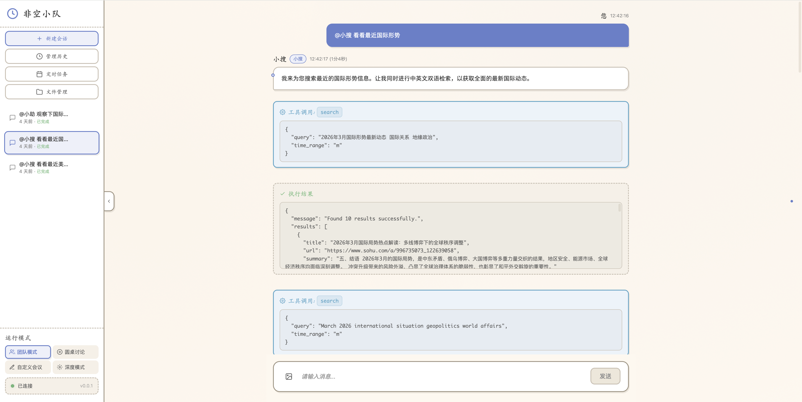
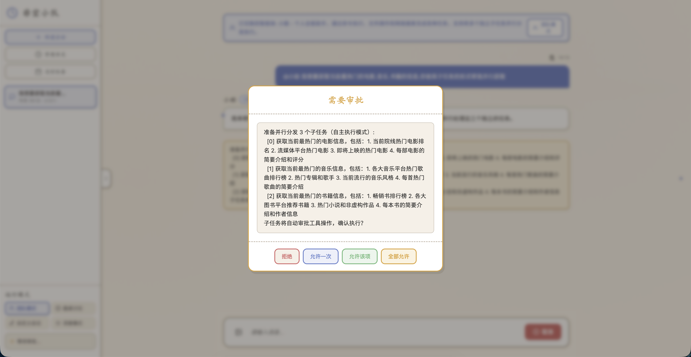
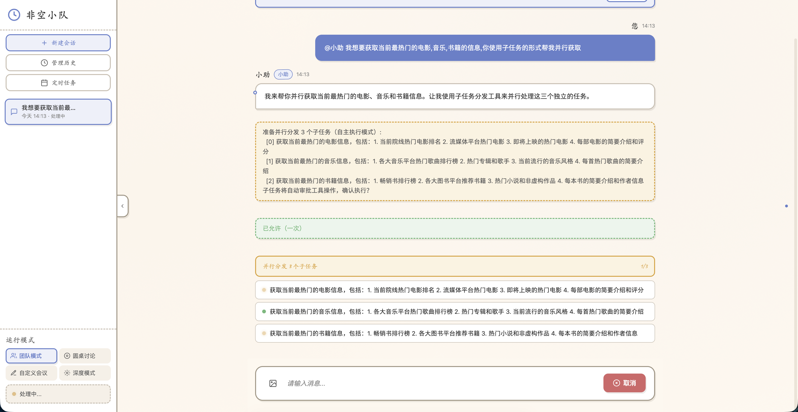
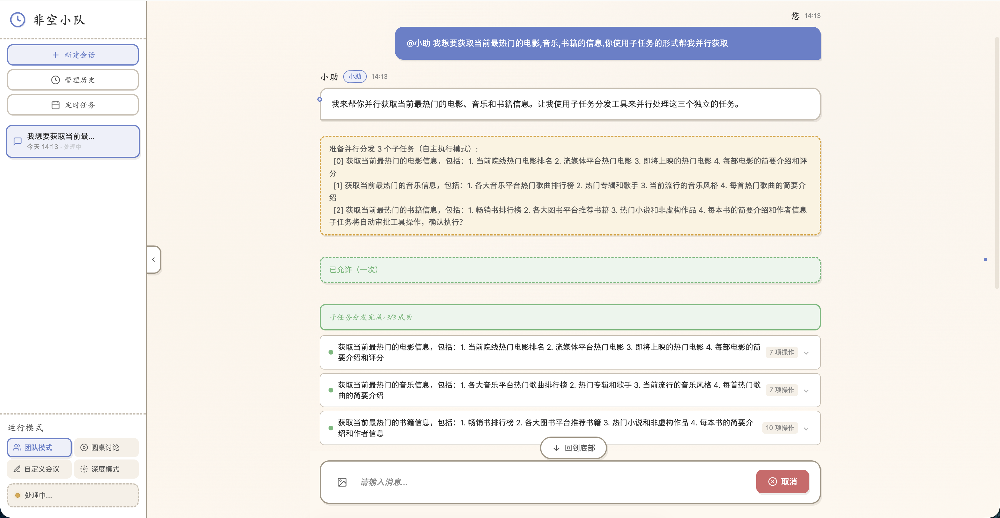
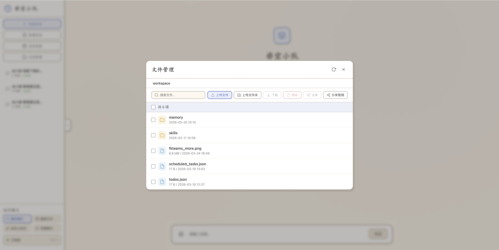
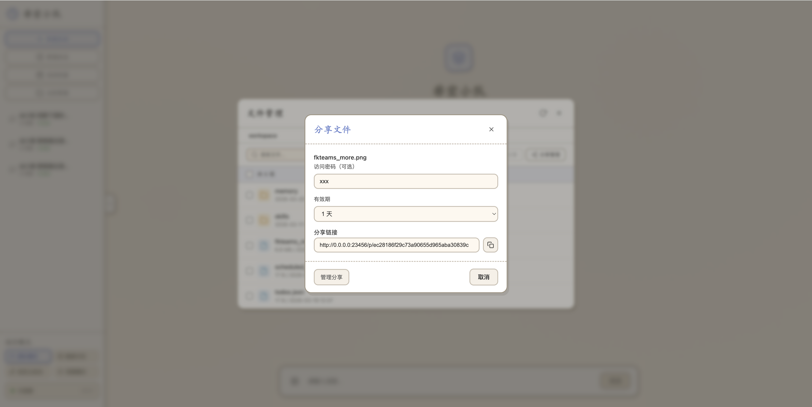
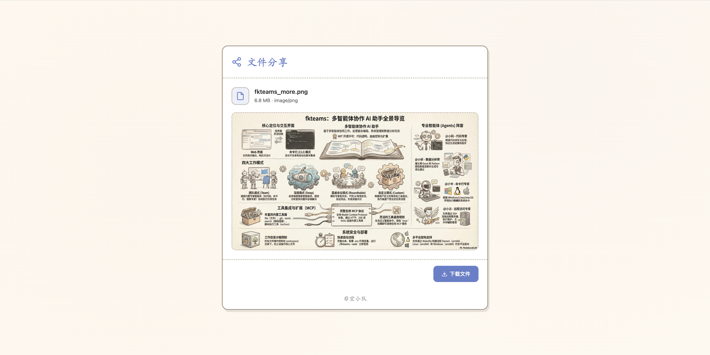
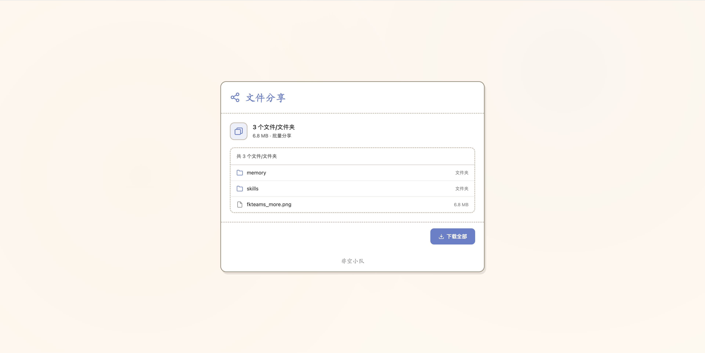
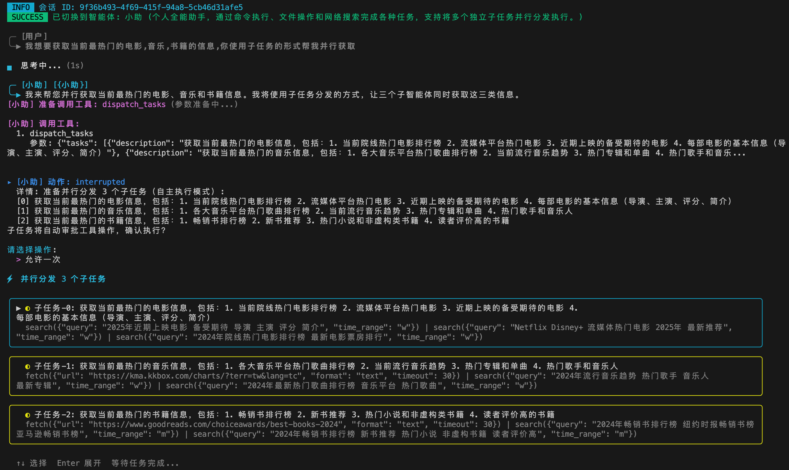
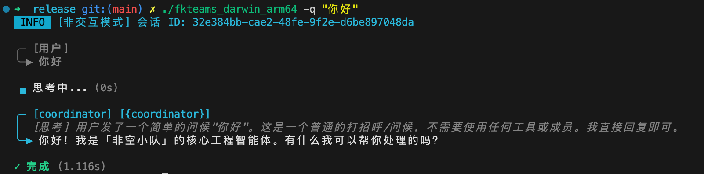

# fkteams 非空小队

fkteams（FeiKong Teams，非空小队）是一个开源的多智能体协作 AI 助手，旨在通过多个专业智能体的协同工作来完成复杂的任务。它支持两种交互界面：现代化的 Web 界面和传统的命令行界面，满足不同用户的使用习惯和场景需求。


## 演示图

|                     登录界面                     |                   主界面                    |
| :----------------------------------------------: | :-----------------------------------------: |
|  |  |

|                   审批                    |                    子任务进行中                    |
| :---------------------------------------: | :------------------------------------------------: |
|  |  |

|                    子任务完成                     |                   文件管理                    |
| :-----------------------------------------------: | :-------------------------------------------: |
|  |  |

|                       文件分享                       |                        密码访问                         |
| :--------------------------------------------------: | :-----------------------------------------------------: |
|  |  |

|                        分享预览                         |                        批量分享预览                         |
| :-----------------------------------------------------: | :---------------------------------------------------------: |
|  |  |

|                    并行子任务                     |
| :-----------------------------------------------: |
|  |

|                    非交互模式                    |
| :----------------------------------------------: |
|  |

## 功能特性

- **多智能体协作**：内置多个专业智能体（代码、搜索、命令行、数据分析、SSH 等），由统御智能体智能调度
- **四种工作模式**：团队模式、深度模式、圆桌会议模式、自定义模式
- **双界面支持**：现代化 Web 界面 + 命令行界面
- **MCP 工具生态**：完整支持 MCP 协议，轻松接入外部工具
- **自定义智能体**：通过配置文件灵活创建专业智能体
- **聊天通道集成**：支持接入 QQ、Discord 等即时通讯平台
- **长期记忆**：跨会话自动记忆，助手越用越顺手
- **多模态输入**：支持文本、图片、音频、视频和文件
- **推理模型支持**：流式展示思考过程（DeepSeek-R1、o1/o3 等）
- **Skills 技能系统**：动态加载技能提升特定任务表现
- **定时任务**：自然语言设置定时任务，后台静默执行
- **子任务并行**：小助智能体支持多子任务并行处理

## 快速开始

> **快速体验**：如果你已经有预编译的可执行文件，只需要配置环境变量并运行 `./fkteams web` 即可立即体验 Web 界面！

### 1. 克隆项目

```bash
git clone https://github.com/wsshow/feikong-teams.git
cd feikong-teams
```

### 2. 配置环境变量

```bash
cp .env.example .env
```

编辑 `.env` 文件，填写基本配置：

```env
# 模型配置（必填）
FEIKONG_API_KEY=your_api_key_here
FEIKONG_BASE_URL=https://api.openai.com/v1
FEIKONG_MODEL=gpt-5
```

> 完整配置项请参考 [配置指南](./docs/configuration.md)

### 3. 运行

```bash
# Web 界面模式（推荐）
go run main.go web

# 命令行模式
go run main.go

# 编译后运行
make build
./release/fkteams_darwin_arm64 web
```

启动后访问 `http://localhost:23456` 即可使用。

> 更多运行模式和命令行参数请参考 [使用指南](./docs/usage.md)

## 内置智能体

| 智能体  | 说明                                   |
| ------- | -------------------------------------- |
| `@小码` | 代码专家，擅长读写和处理代码文件       |
| `@小搜` | 情报搜索专家，擅长中英文双语检索       |
| `@小令` | 命令行专家，根据操作系统执行命令       |
| `@小析` | 数据分析专家，Excel 和 Python 数据处理 |
| `@小访` | 远程访问专家，SSH 连接和远程管理       |
| `@小说` | 讲故事专家，编写引人入胜的故事         |
| `@小简` | 总结专家，提炼简洁摘要                 |
| `@小助` | 个人全能助手，支持子任务并行执行       |

## 文档导航

| 文档                                    | 说明                                     |
| --------------------------------------- | ---------------------------------------- |
| [配置指南](./docs/configuration.md)     | 环境变量、config.toml 配置               |
| [使用指南](./docs/usage.md)             | 运行模式、CLI 命令、智能体切换、定时任务 |
| [圆桌会议模式](./docs/roundtable.md)    | 多模型讨论模式的原理和配置               |
| [Skills 指南](./docs/skills.md)         | 技能系统的使用和配置                     |
| [MCP 工具集成](./docs/mcp.md)           | MCP 协议集成和常用服务配置               |
| [自定义智能体](./docs/custom-agents.md) | 创建和配置自定义智能体                   |
| [聊天通道](./docs/channels.md)          | QQ、Discord、微信等平台接入              |
| [长期记忆](./docs/memory.md)            | 记忆提取、存储、检索机制                 |
| [多模态支持](./docs/multimodal.md)      | 图片、音频、视频等多模态输入             |
| [推理模型支持](./docs/reasoning.md)     | 推理/思考模型的流式输出                  |
| [部署指南](./docs/deployment.md)        | 构建、Docker 部署                        |
| [安全说明](./docs/security.md)          | 安全机制和注意事项                       |
| [API 文档](./docs/api/)                 | HTTP/WebSocket API 接口                  |

## 构建

```bash
make clean && make build
```

## Docker 部署

```bash
# docker-compose（推荐）
docker compose up -d

# 或 docker run
docker build -t fkteams .
docker run -d --name fkteams -p 23456:23456 \
  -e FEIKONG_BASE_URL=https://api.openai.com/v1 \
  -e FEIKONG_API_KEY=your_api_key_here \
  -e FEIKONG_MODEL=GPT-5 \
  fkteams
```

> 详细部署配置请参考 [部署指南](./docs/deployment.md)

## 许可证

本项目采用 MIT 许可证。详见 [LICENSE](LICENSE) 文件。

## 致谢

- [Bubble Tea](https://github.com/charmbracelet/bubbletea) - 基于 Elm 架构的终端 UI 框架
- [Pterm](https://github.com/pterm/pterm) - 美观的终端 UI 库
- [Cloudwego Eino](https://github.com/cloudwego/eino) - 强大的 AI 编程框架
- [MCP Go](https://github.com/mark3labs/mcp-go) - Go 语言的 MCP 协议实现
- [Model Context Protocol](https://modelcontextprotocol.io/) - AI 工具集成标准协议

## 相关链接

- [MCP 官方文档](https://modelcontextprotocol.io/)
- [MCP 服务器列表](https://github.com/modelcontextprotocol/servers)
- [Cloudwego Eino 文档](https://github.com/cloudwego/eino)
- [项目 GitHub](https://github.com/wsshow/feikong-teams)
